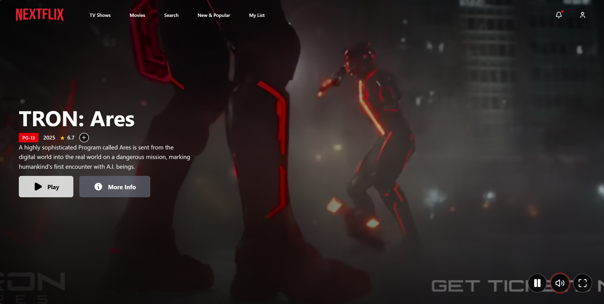

# NEXTFLIX - Netflix Clone

A fully functional Netflix clone built with Next.js 15, TypeScript, Tailwind CSS, and The Movie Database (TMDB) API.



## Features

- 🎬 **Hero Section**: Random trending movie with trailer background and video controls
- 🎥 **Movie Cards**: Interactive cards with hover effects showing ratings, year, and descriptions
- 🔍 **Search Functionality**: Real-time movie search with TMDB API
- 📱 **Responsive Design**: Works seamlessly on desktop, tablet, and mobile
- 🎮 **Video Controls**: Play/pause, mute/unmute, and restart trailer functionality
- 🎭 **Multiple Categories**: Trending, Popular, Top Rated, Now Playing, and Coming Soon
- ✨ **Smooth Animations**: Netflix-style hover effects and transitions
- 🎨 **Dark Theme**: Modern dark UI matching Netflix's design language

## Tech Stack

- **Framework**: Next.js 15 with App Router
- **Language**: TypeScript
- **Styling**: Tailwind CSS
- **API**: The Movie Database (TMDB)
- **Icons**: Lucide React
- **Image Optimization**: Next.js Image component

## Prerequisites

Before running this project, you need:

1. **Node.js** (version 18 or higher)
2. **TMDB API Key** - Get one from [The Movie Database](https://www.themoviedb.org/settings/api)

## Getting Started

### 1. Clone the repository

```bash
git clone <your-repo-url>
cd nextflix
```

### 2. Install dependencies

```bash
npm install
```

### 3. Set up environment variables

Create a `.env.local` file in the root directory:

```env
NEXT_PUBLIC_TMDB_API_KEY=your_tmdb_api_key_here
```

Replace `your_tmdb_api_key_here` with your actual TMDB API key.

### 4. Run the development server

```bash
npm run dev
```

Open [http://localhost:3000](http://localhost:3000) with your browser to see the application.

## Project Structure

```
nextflix/
├── app/                    # Next.js App Router
│   ├── globals.css        # Global styles
│   ├── layout.tsx         # Root layout
│   └── page.tsx          # Home page (Server Component)
├── components/            # React components
│   ├── ClientWrapper.tsx  # Client-side wrapper for interactivity
│   ├── Header.tsx         # Navigation header with search
│   ├── HeroSection.tsx    # Hero banner with video
│   ├── MovieCard.tsx      # Individual movie card
│   └── MovieRow.tsx       # Horizontal scrolling movie rows
├── lib/                   # Utility functions
│   └── tmdb.ts           # TMDB API integration
├── public/               # Static assets
│   └── placeholder-movie.svg # Fallback movie poster
└── ...config files
```

## Key Components

### HeroSection
- Displays a random trending movie as the main banner
- Video background with YouTube trailer (when available)
- Play/pause, mute/unmute, and restart controls
- Smooth image overlay during video loading

### MovieCard
- Interactive movie cards with Netflix-style hover effects
- Shows movie poster, title, rating, year, and overview
- Expandable detailed view on hover
- Responsive design for different screen sizes

### MovieRow
- Horizontally scrolling rows of movies
- Left/right navigation arrows
- Smooth scroll behavior
- Categories: Trending, Popular, Top Rated, etc.

### Header
- Fixed navigation with Netflix-style transparency
- Search functionality with real-time results
- Responsive design with mobile support

## API Integration

The app uses The Movie Database (TMDB) API for:

- **Trending Movies**: `/trending/movie/{time_window}`
- **Popular Movies**: `/movie/popular`
- **Top Rated Movies**: `/movie/top_rated`
- **Now Playing**: `/movie/now_playing`
- **Upcoming Movies**: `/movie/upcoming`
- **Movie Videos**: `/movie/{movie_id}/videos`
- **Search Movies**: `/search/movie`

All API calls include error handling and fallbacks.

## Styling

The project uses:

- **Tailwind CSS** for utility-first styling
- **Custom CSS** for Netflix-specific animations
- **CSS Variables** for consistent theming
- **Responsive Design** with mobile-first approach

Key design features:
- Netflix red (#E50914) accent color
- Dark theme with subtle gradients
- Smooth hover transitions
- Card-based layout system

## Performance Optimizations

- **Next.js Image Optimization**: Automatic image resizing and format selection
- **Server Components**: Data fetching on the server for better performance
- **Client Components**: Interactive features only where needed
- **Lazy Loading**: Images and components load as needed
- **Caching**: TMDB API responses are cached

## Environment Variables

| Variable | Description | Required |
|----------|-------------|----------|
| `NEXT_PUBLIC_TMDB_API_KEY` | Your TMDB API key | Yes |

## Available Scripts

```bash
npm run dev          # Start development server
npm run build        # Build for production
npm run start        # Start production server
npm run lint         # Run ESLint
```

## Browser Support

- Chrome (latest)
- Firefox (latest)
- Safari (latest)
- Edge (latest)

## Contributing

1. Fork the project
2. Create a feature branch (`git checkout -b feature/AmazingFeature`)
3. Commit your changes (`git commit -m 'Add some AmazingFeature'`)
4. Push to the branch (`git push origin feature/AmazingFeature`)
5. Open a Pull Request

## License

This project is licensed under the MIT License - see the [LICENSE](LICENSE) file for details.

## Acknowledgments

- [The Movie Database (TMDB)](https://www.themoviedb.org/) for the movie data API
- [Netflix](https://netflix.com) for design inspiration
- [Next.js](https://nextjs.org/) for the amazing React framework
- [Tailwind CSS](https://tailwindcss.com/) for the utility-first CSS framework

## Troubleshooting

### Common Issues

1. **API Key Error**: Make sure your TMDB API key is correctly set in `.env.local`
2. **Images Not Loading**: Check your internet connection and TMDB API status
3. **Videos Not Playing**: Some trailers may not be available or may be region-locked

### Getting Help

If you encounter any issues:

1. Check the console for error messages
2. Verify your API key is valid
3. Ensure all dependencies are installed
4. Check the [TMDB API documentation](https://developers.themoviedb.org/3)

---

Built with ❤️ using Next.js and the TMDB API
